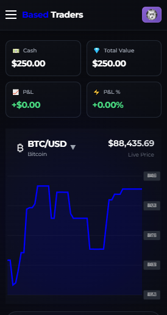
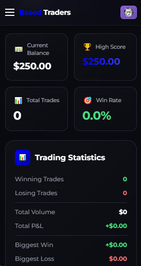

# Based Traders

A minimalistic leveraged trading game built on React + Vite with WalletConnect integration.

## Screenshots




## Features

- 🎮 **Real-time Trading**: Centralized price engine - same price for all users
- 💰 **$1000 Starting Capital**: Each wallet gets $1000 virtual cash
- ⚡ **Leverage Trading**: 5x, 10x, and 25x leverage options
- 📈 **Long/Short Positions**: Trade both directions
- 💸 **5% Position Fee**: Prevents instant buy/sell arbitrage
- 🔗 **Wallet Connection**: Connect via WalletConnect/RainbowKit
- 📊 **Real-time Chart**: Live price visualization
- 🚨 **Liquidation Warnings**: Visual alerts for risky positions

## Setup

1. **Install Dependencies**
```bash
npm install
```

2. **Configure WalletConnect**
   - Get a project ID from [WalletConnect Cloud](https://cloud.walletconnect.com/)
   - Create a `.env` file:
```bash
VITE_WALLETCONNECT_PROJECT_ID=your_project_id_here
```

3. **Run Development Server**
```bash
npm run dev
```

4. **Build for Production**
```bash
npm run build
```

## How It Works

### Price Engine
- **Centralized**: All users see the same price in real-time
- **Updates**: Price updates every second with 1.5% volatility
- **Random Walk**: Simulated market movements

### Trading Mechanics
1. **Connect Wallet**: Get $1000 virtual cash assigned to your wallet
2. **Choose Position**: Set amount and leverage (5x, 10x, 25x)
3. **Pay Fee**: 5% fee deducted from position
4. **Open Trade**: Go LONG or SHORT
5. **Monitor**: Watch your P&L in real-time
6. **Close or Liquidate**: Close for profit/loss or get liquidated

### Liquidation Thresholds
- **5x Leverage**: -20% price movement
- **10x Leverage**: -10% price movement
- **25x Leverage**: -4% price movement

## Tech Stack

- **Frontend**: React 19 + Vite
- **Styling**: Tailwind CSS
- **Wallet**: Wagmi + RainbowKit
- **State Management**: React hooks + singleton pattern
- **Charts**: Custom SVG charts

## Key Features

### 5% Position Fee
Every position has a 5% fee to prevent instant trading:
- Amount: $100
- Fee: $5 (5%)
- Net Collateral: $95
- With 10x leverage: $950 position size

This ensures traders can't instantly buy and sell for profit.

### Wallet-Based State
Each connected wallet gets:
- Initial $1000 virtual cash
- Persistent state (stored in memory)
- Individual position tracking

### Real-time Updates
- Price updates every 1 second
- Position P&L calculated in real-time
- Automatic liquidation detection
- Visual warnings for near-liquidation

## License

MIT
